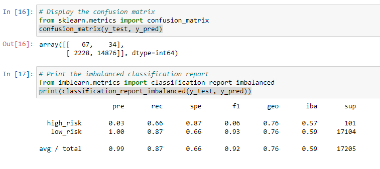

# Credit_Risk_Analysis

## Overview

The general purpose of this project is to evaluate credit risk amongst a large data set, which looking at lone statistics is very complicated to understand and parts through that data without utilizing something like machine learning to sift through all of the results you have. We wanted to simplify the process of understanding if someone was a hello or a high-risk potential client for us by creating a model in various machine learning processes utilizing the imbalanced-learn and scikit-learn libraries. We tested a variety of models and strategies, will utilized oversampling, SMOTE, undersampling, random forest, easy ensemble adaBoost classifier, and SMOTEENN. Through utilizing a variety of methods we can compare our accuracy, precision, and recall to determine which method should be utilized in the future to produce a more useful prediction.

## Results

- Naive random oversampling resulted in a balance accuracy of 64.95%, a precision of 1%,and a recall of 73%

- SMOTE had a balanced accuracy of 65.84%, a precision of %1 and a recall of 63%.

- Undersampling had a results of 54.47% for the balanced accuracy, a precision of 1% and a recall of 69%

- SMOTEENN had a balanced accuracy score of 64.85%, a precision of 1%, and a recall of 72%.

- The balanced random forest clarifier had a balance accuracy score of 76.66%, a precision of 3%, and a recall of 66%.

- And finally the easy ensemble adaBoost classifier had a balanced accuracy score of 93.32%, a precision of 9%, and a recall of 92%.

## Summary

It appears that a majority of the models had a big issue with accuracy in terms of predicting whether there is a high-risk or low risk possibility for our customers. Looking at the resampling models, naive random oversampling and SMOTEENN appeared to be the most useful production models of that prediction style. However moving on to the ensemble model types both of them beats the re-sampling data styles however easy ensemble classifier had the highest accuracy precision and recall percentage of all the models. I would recommend Easy ensemble to be utilized as the predictor for Credit risk amongst our loan status of our customers.

